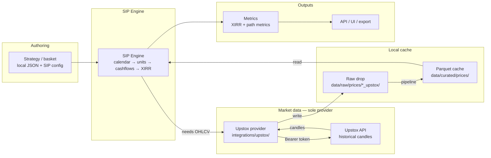
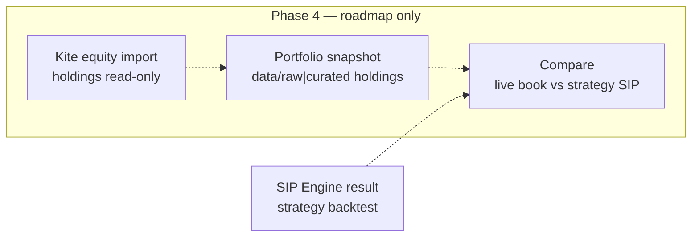

# Integrations Overview — SIP Lab / Basket Backtest Engine

**Status:** Binding architecture sketch (SIP Lab)  
**Audience:** Backend, data engineer, frontend, PO  
**Related:**
- [ADR 004 — SIP Lab PRD decisions](../decisions/004-sip-lab-prd-decisions.md)
- [ADR 005 — Upstox sole market data](../decisions/005-upstox-sole-market-data.md)
- [Upstox contract](../integrations/upstox.md)
- [Kite Phase 4 plan (not implemented)](../integrations/kite-connect.md)
- [ROADMAP](../ROADMAP.md) · [PRD](../product/prd-sip-lab.md)

---

## 1. Purpose

This document is the **system-level map** of how SIP Lab wires strategy definition, market data, cache, engine, and UI. It is intentionally short: detail lives in the Upstox contract and ADRs.

**One rule above all others:** historical equity/ETF OHLCV comes from the **Upstox API only**. There is **no multi-provider chain**, no fallback vendor, and no “try Upstox then yfinance” path in product code.

---

## 2. End-to-end data flow

### 2.1 Current product path (solid)



**Narrative (left → right):**

1. **Strategy** — local basket + SIP config (amount, day-of-month, start/end, allocation mode). Not scraped from Smallcase.com.
2. **SIP Engine** — pure-ish simulation: fixed calendar day → next trading day; cash → units; cashflow series; **XIRR** primary (tolerance ≤ `1e-4` on fixtures).
3. **Upstox provider** — sole live `MarketDataProvider`; extends `src/smallcase_finance/integrations/upstox/`.
4. **Parquet cache** — immutable dated raw drops → pipeline → curated Parquet; engine and API read **curated** only.
5. **Metrics / UI** — XIRR + secondary path metrics; Next.js / FastAPI / CSV·JSON export.

### 2.2 Phase 4 only (dashed) — not this implementation wave



| Phase 4 item | Role | Not a role |
|--------------|------|------------|
| **Kite equity import** | Read-only equity holdings | Price source, orders, F&O |
| **Portfolio snapshot** | Dated holdings under `data/` | Live trading book sync as product |
| **Compare** | Live equity book vs SIP backtest of strategy | Replacing Upstox for OHLCV |

Kite is **never** a historical candle provider in this product version. Coin / MF is **after** Phase 4 equity path — not drawn here as an active integration.

### 2.3 Explicitly absent: multi-provider chain

```text
  ❌  Strategy → SIP → [Upstox | yfinance | bhavcopy | Fyers] → cache
  ✅  Strategy → SIP → Upstox only → Parquet cache → metrics/UI
```

| Allowed | Forbidden (this version) |
|---------|--------------------------|
| Upstox historical candles for real runs | yfinance, NSE bhavcopy, Fyers, paid multi-vendor sprawl |
| Labeled **sample** prices for demos without token | Silent vendor fill when Upstox bars are missing |
| Local JSON strategy / smallcase defs | Smallcase.com scrape as market data |
| Future Kite **holdings** (Phase 4) | Kite as OHLCV source |

Missing `instrument_key` or candles → **warn / skip / partial**, never invent prices from another vendor.

---

## 3. Component map (code ↔ role)

| Layer | Location (reuse / extend) | Responsibility |
|-------|---------------------------|----------------|
| Strategy / basket | `data/raw/smallcases/`, future strategy config schema | Constituents, weights/mode, SIP params |
| SIP Engine | `calc/` + services (dedicated SIP path; **not** v0 rebalance NAV) | Sessions, units ledger, cashflows, XIRR |
| Upstox provider | `src/smallcase_finance/integrations/upstox/` | Auth, candles, instrument_key map, raw write |
| Pipeline | `src/smallcase_finance/pipeline/` | Raw → curated Parquet |
| Cache read | `data_access/` + DuckDB | Curated prices for engine/API |
| Metrics | `calc/` + services | XIRR primary; secondary path metrics |
| API | FastAPI `api/routes/` | Strategies, SIP backtest, export, Upstox status |
| UI | `apps/web` | SIP Lab surface + data-source banner |
| Phase 4 Kite | *not implemented* — plan in [kite-connect.md](../integrations/kite-connect.md) | Equity holdings import only |

**Dependency direction:**

```text
api → services → data_access → curated Parquet
              ↘ calc (no I/O)
integrations/upstox → raw drops only (CLI / guarded sync)
pipeline → raw → curated
```

---

## 4. API sketch (SIP Lab)

v0 already exposes smallcase NAV/rebalance endpoints. SIP Lab adds a **dedicated** SIP surface. Names below are the target contract sketch (implement in P0–P2); detail may refine without changing the topology.

### 4.1 Strategies

| Method | Path | Purpose |
|--------|------|---------|
| `GET` | `/strategies` | List local strategies / baskets (id, name, theme, SIP defaults if any) |
| `GET` | `/strategies/{id}` | Strategy detail + constituents |
| `POST` | `/strategies` | *(optional later)* Create/update local strategy config |

**Notes:** v0 `/smallcases*` may remain as the basket list until strategy schema lands; SIP Lab should not overload `POST /backtest` (rebalance sim) for SIP cashflows.

### 4.2 SIP backtest

| Method | Path | Purpose |
|--------|------|---------|
| `POST` | `/backtests/sip` | Run monthly SIP for a strategy over curated prices |

**Request sketch (illustrative):**

```json
{
  "strategy_id": "digital-india",
  "sip_amount": 10000,
  "day_of_month": 5,
  "start": "2021-01-01",
  "end": null,
  "allocation_mode": "target_weight",
  "currency": "INR"
}
```

| Field | Rule |
|-------|------|
| `day_of_month` | Fixed calendar day; non-session → **next trading day** |
| Costs | Zero MVP (no brokerage/STT/slippage fields required) |
| Prices | From curated Parquet (Upstox-sourced or labeled sample) |

**Response sketch (illustrative):**

```json
{
  "strategy_id": "digital-india",
  "xirr": 0.1423,
  "data_source": "upstox",
  "used_sample_fallback": false,
  "cashflows": [
    { "date": "2021-01-05", "amount": -10000 },
    { "date": "2024-06-28", "amount": 185432.10 }
  ],
  "series": {
    "dates": ["..."],
    "market_value": ["..."],
    "units_by_symbol": {}
  },
  "secondary": {
    "cagr": null,
    "max_drawdown": null,
    "total_contributed": 400000
  }
}
```

- **Primary metric:** `xirr` (fixtures ≤ `1e-4` absolute vs reference).
- **`data_source` / sample flag:** must surface so UI can banner demo runs.

### 4.3 Results export

| Method | Path | Purpose |
|--------|------|---------|
| `GET` | `/backtests/sip/{run_id}/export` | Export last/stored run (CSV or JSON) |
| *or* | response body + client download | Stateless MVP: client exports from `POST` response |

MVP may skip persisted `run_id` and export client-side from the `POST /backtests/sip` payload. When persistence lands, export is the same cashflows + summary schema.

### 4.4 Market-data ops (existing / keep)

| Method | Path | Purpose |
|--------|------|---------|
| `GET` | `/integrations/upstox/status` | Configured? (never returns secrets) |
| `GET` | `/integrations/upstox/lookback-preview` | Resolve years/from/to without fetch |
| `POST` | `/integrations/upstox/sync` | Disabled unless `UPSTOX_SYNC_ENABLED=1`; prefer CLI |

### 4.5 Not in API this version

| Endpoint class | Status |
|----------------|--------|
| Coin / MF holdings or NAV | **Do not implement** |
| Order placement / trade APIs | **Do not implement** |
| Kite holdings import | Phase 4 only |
| Multi-provider price proxy | **Do not implement** |

---

## 5. Environment variables — Upstox credentials

Repo is **public**. Secrets live in gitignored `.env` or the shell only. Empty placeholders in `.env.example`.

| Env var | Required for live prices? | Secret? | Meaning |
|---------|---------------------------|---------|---------|
| **`UPSTOX_ACCESS_TOKEN`** | **Yes** | **Yes** | Bearer token for historical candle APIs. **Primary.** |
| `UPSTOX_API_KEY` | OAuth app id / token exchange | Treat as secret | Official Upstox **API Key** (`client_id`). **Not** a Bearer alias. |
| `UPSTOX_API_SECRET` | OAuth token exchange only | **Yes** | Official **API Secret** (`client_secret`). Not used by CLI sync today. |
| `UPSTOX_REDIRECT_URI` | OAuth only | No | Must match developer app config. |
| `UPSTOX_API_BASE` | No | No | Default `https://api.upstox.com/v2` (V3 daily preferred for multi-year SIP ranges; see [upstox.md](../integrations/upstox.md)). |
| `UPSTOX_DEFAULT_YEARS` | No | No | Default lookback (usually `3`) when `--years` / `--from` not set. |
| `UPSTOX_SYNC_ENABLED` | No | No | Set `1` only for local demos of HTTP sync. Prefer `make sync-upstox` / CLI. |

**Founder MVP auth path:** [Upstox Developer Apps](https://account.upstox.com/developer/apps) → Generate access token → set `UPSTOX_ACCESS_TOKEN` → `make sync-upstox`.

**Token lifetime:** expires **3:30 AM IST the following day** (Upstox docs). No documented refresh token for the common flow — re-generate when expired. Prefer daytime syncs.

Full portal steps, V2/V3 candle URLs, rate limits, and `instrument_key` mapping: [docs/integrations/upstox.md](../integrations/upstox.md).

**Phase 4 (do not wire now):** typical `KITE_API_KEY`, `KITE_API_SECRET`, `KITE_ACCESS_TOKEN` — see [kite-connect.md](../integrations/kite-connect.md).

---

## 6. Operator loop (reproducible run)

```text
1. Set UPSTOX_ACCESS_TOKEN in local .env (never commit)
2. make sync-upstox          # Upstox → raw drop → pipeline → curated Parquet
3. POST /backtests/sip       # strategy + SIP params → XIRR + series
4. UI / export               # labeled data_source (upstox | sample)
```

Without a token: sample prices under `data/raw/prices/*_sample/` power **demos only**. Results must be labeled — not real market SIP claims.

---

## 7. Explicit non-goals (this product version)

| Non-goal | Why |
|----------|-----|
| **Coin import APIs** | MF path deferred after equity; founder equities-first |
| **MF holdings endpoints / MF NAV engine** | Same; no Coin runtime |
| **Order placement / live trading** | Personal research tool, not a broker |
| **yfinance / bhavcopy / Fyers / multi-provider chain** | Upstox sole OHLCV; ADR 005 |
| **F&O** | Out of scope |
| **Multi-user / social SaaS** | Single-founder local-first |
| **Kite as price source** | Phase 4 = equity holdings compare only |
| **Treating v0 rebalance NAV as SIP** | Wrong cashflow semantics for XIRR |

---

## 8. Implementation order (reminder)

1. Correct **SIP engine** (fixtures, XIRR)  
2. **UI** (SIP Lab)  
3. **Kite equity import** + compare (Phase 4)  
4. **Coin / MF** last  

Correctness and a single honest data path beat provider sprawl.

---

## 9. Related docs

| Doc | Use when |
|-----|----------|
| [upstox.md](../integrations/upstox.md) | Auth, env, candle endpoints, CLI |
| [ADR 005](../decisions/005-upstox-sole-market-data.md) | Sole-provider policy |
| [ADR 004](../decisions/004-sip-lab-prd-decisions.md) | SIP day, costs, XIRR, non-goals |
| [backend.md](./backend.md) | FastAPI layering |
| [pipeline.md](../data/pipeline.md) | Raw → curated |
| [kite-connect.md](../integrations/kite-connect.md) | Phase 4 holdings only |
| [api.md](../api.md) | Current v0 curl cookbook (pre-SIP endpoints) |
